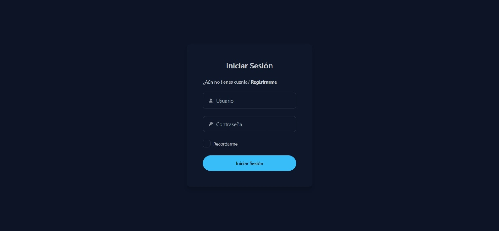
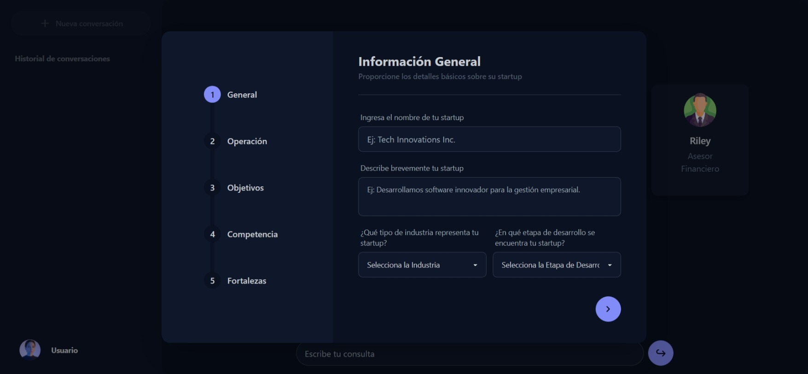
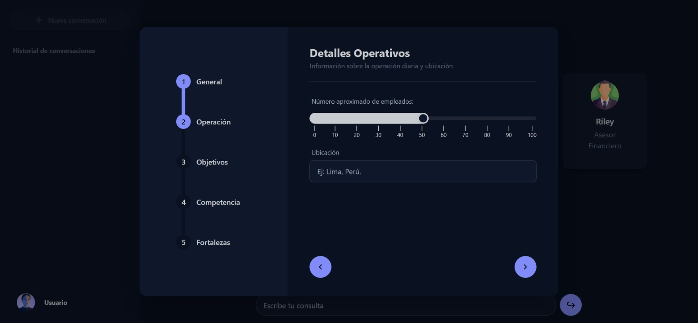
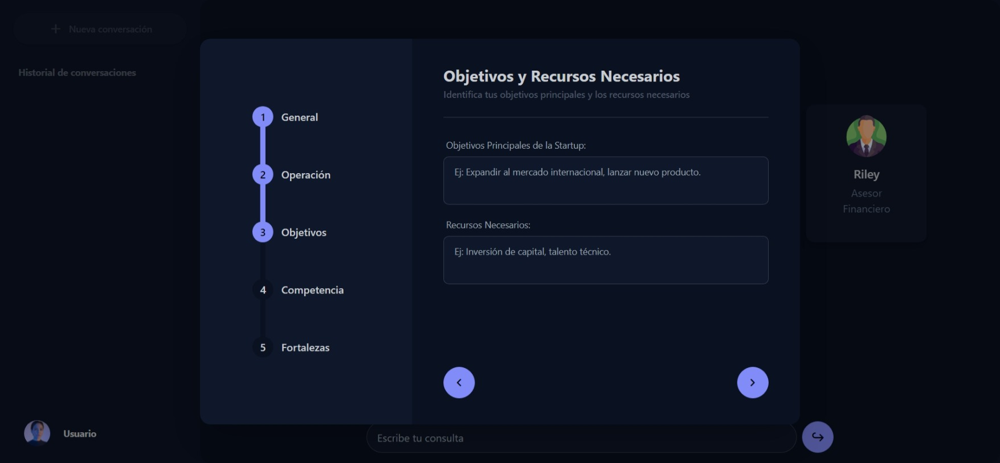
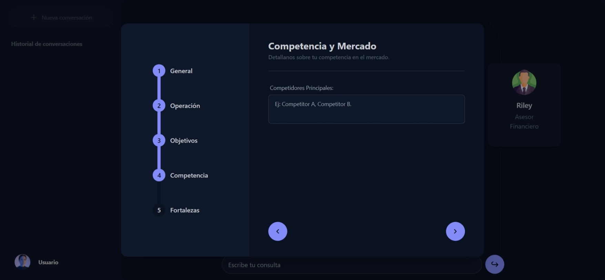
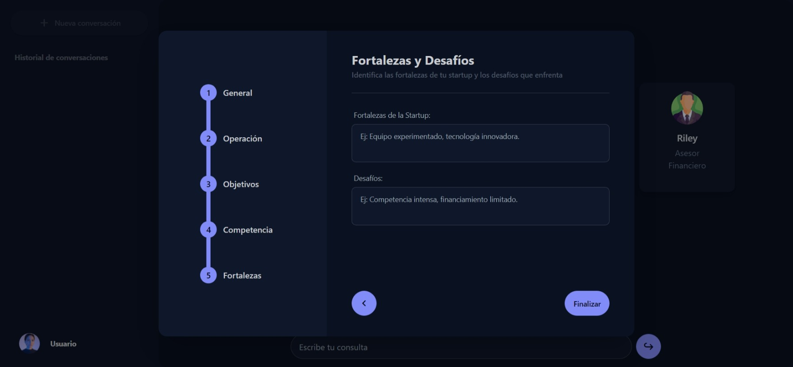
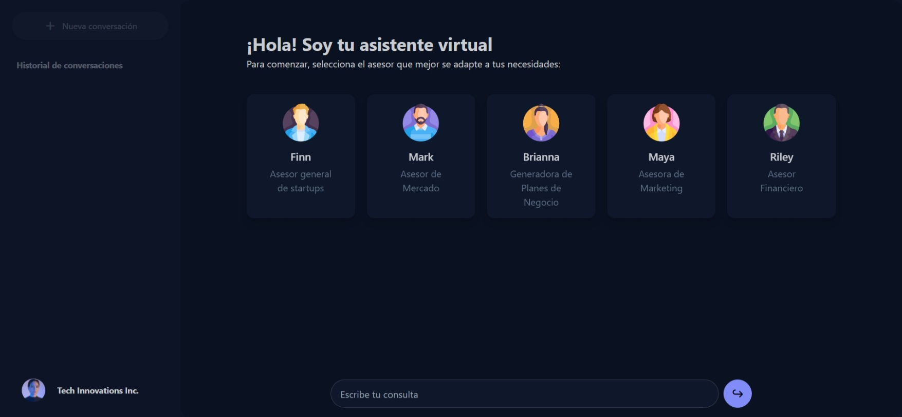
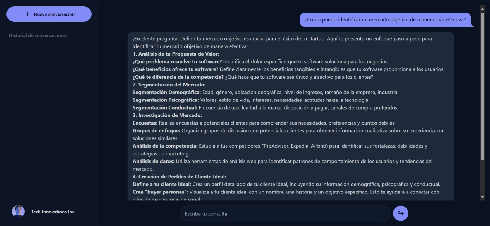

# Chatbot Startup Assistant

## Descripción

Este es el frontend de un chatbot diseñado para ayudar a startups en su desarrollo inicial. El chatbot proporciona asistencia específica y personalizada a través de perfiles adaptados a diferentes temas y necesidades comunes en las etapas tempranas de una startup, todo esto potenciado por la API de GEMINI que fue trabajado en un backend propio desarrollado en NodeJS.

## Características

- **Asistencia personalizada**: El chatbot ofrece respuestas y consejos adaptados a las necesidades específicas de cada startup.
- **Perfiles temáticos**: Incluye perfiles para áreas como marketing, financiamiento, desarrollo de producto y más.
- **Interfaz amigable**: Un diseño intuitivo y fácil de usar para asegurar una buena experiencia de usuario.

## Tecnologías Utilizadas

- **React**: Para la construcción de la interfaz de usuario.
- **TailwindCSS**: Para el diseño de estilos.
- **DaisyUI**: Para la libreria de componentes.
- **Axios**: Para la comunicación con la API del backend.

## Capturas de la App

